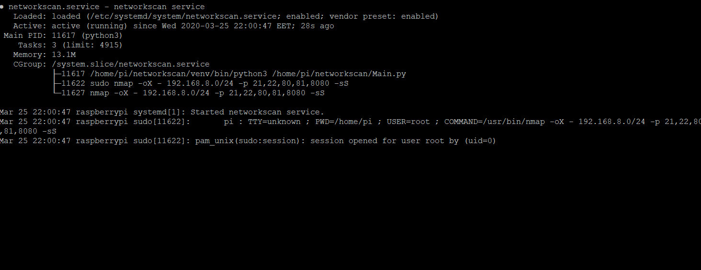

# Networkscan
> Raspberry Pi local network device scanner - open port and default password checking for multiple vendors.
## Table of Contents
- [Requirements](#Requirements)
- [Installation](#Installation)
- [How it works](#How-it-works)
- [Author](#Author)
- [License](#License)

## Requirements
Raspberry Pi Model 3 or 4

Raspberry Pi 1 or 2 - external bluetooth adapter required

## Installation
### RPi software setup
Nmap - for scanning network
```console
pi@raspberrypi:~ $ sudo apt-get install python3-nmap -y
```
Bluez-tools - for bluetooth file transfer
```console
pi@raspberrypi:~ $ sudo apt-get install bluetooth bluez-tools -y
```
Git - for cloning repository
```console
pi@raspberrypi:~ $ sudo apt-get install git -y
```
### Software installation
Clone repository
```console
pi@raspberrypi:~ $ git clone https://github.com/tomsozolins/networkscan.git /home/pi/networkscan
```
Navigate to networkscan directory
```console
pi@raspberrypi:~ $ cd /home/pi/networkscan
```
Create virtual environment
```console
pi@raspberrypi:~ $ python3 -m venv venv
```
Activate virtual environment
```console
pi@raspberrypi:~ $ . /home/pi/networkscan/venv/bin/activate
```
Install required python packages
```console
pi@raspberrypi:~ $ pip3 install -r /home/pi/networkscan/requirements.txt
```
### Networkscan service setup
Create networkscan service
```console
pi@raspberrypi:~ $ sudo vi /etc/systemd/system/networkscan.service
```

networkscan.service
```
[Unit]
Description=networkscan service
Requires=network-online.target

[Service]
User=pi
WorkingDirectory=/home/pi/
ExecStart=/home/pi/networkscan/venv/bin/python3 /home/pi/networkscan/Main.py
Restart=always
RestartSec=30

[Install]
WantedBy=multi-user.target
```
Enable networkscan service at startup
```console
pi@raspberrypi:~ $ sudo systemctl enable networkscan
```

### Bluetooth destination setup
Get your phone MAC address
```console
pi@raspberrypi:~ $ sudo hcitool scan
```
```
Scanning ...
        A8:7D:12:51:91:37       HUAWEI P20 lite
```
Modify Bluetooth destination
```console
pi@raspberrypi:~ $ sudo vi /home/pi/networkscan/Main.py
```
Replace MAC_ADDRESS with your destination MAC
```python3
bt-obex -p MAC_ADDRESS /tmp/output.txt
```
## How it works
### Raspberry Pi

### Service behavior - Interface UP
- **Start python networkscan software**
    - Scan network hosts with Nmap
    - Scan defined open ports for found vendor hosts
    - Do http auth request with default manufacturer password
- **Save scanning results to /tmp/output.txt**
- **Send output.txt to remote destination via Bluetooth**
- **Sleep 30 seconds and restart service**


### Receiving scanning results from RPi to Android phone

### Service behavior - Interface DOWN
### Networkscan program


## Author
* **Toms Ozoliņš**

## License
This project is licensed under the MIT License - see the [LICENSE.md](LICENSE.md) file for details