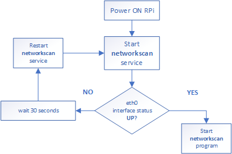
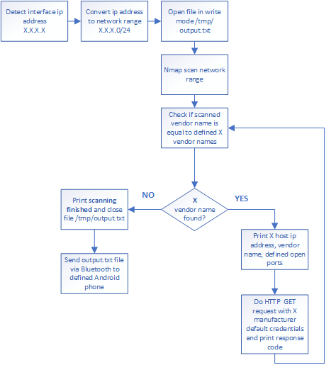

# Networkscan
> Raspberry Pi local network device scanner - open port, default password check for multiple vendors.
### Requirements
Raspberry Pi Model 3 or 4
### Installation
Nmap:
```
# sudo apt-get install python3-nmap -y
```
Bluez-tools:
```
# sudo apt-get install bluez-tools -y
```
## How it works
Raspberry Pi

Networkscan program


## Author
* **Toms Ozolins**

## License
This project is licensed under the MIT License - see the [LICENSE.md](LICENSE.md) file for details