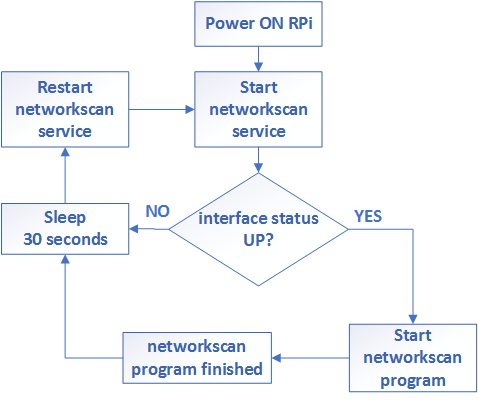

# Networkscan
> Raspberry Pi local network device scanner - open port and default password checking for multiple vendors.
## Table of Contents
- [Requirements](#Requirements)
- [Installation](#Installation)
- [How it works](#How-it-works)
- [Demo](#Demo)
- [Author](#Author)
- [License](#License)

## Requirements
Raspberry Pi Model 3 or 4

## Installation
### RPi software setup
Nmap - for scanning network
```bash
# sudo apt-get install python3-nmap -y
```
Bluez-tools - for bluetooth file transfer
```bash
# sudo apt-get install bluetooth bluez-tools -y
```
Git - for cloning repository
```shell script
sudo apt-get install git -y
```
### Software installation
Clone repository
```shell script
git clone https://github.com/tomsozolins/networkscan.git /home/pi/networkscan
```
Navigate to networkscan directory
```shell script
cd /home/pi/networkscan
```
Create virtual environment
```shell script
python3 -m venv venv
```
Activate virtual environment
```shell script
. /home/pi/networkscan/venv/bin/activate
```
Install required python packages
```shell script
pip3 install -r /home/pi/networkscan/requirements.txt
```
### Networkscan service setup
Create networkscan service
```shell script
sudo vi /etc/systemd/system/networkscan.service
```

networkscan.service
```
[Unit]
Description=networkscan service
Requires=network-online.target

[Service]
User=pi
WorkingDirectory=/home/pi/
ExecStart=/home/pi/networkscan/venv/bin/python3 /home/pi/networkscan/Main.py
Restart=always
RestartSec=30

[Install]
WantedBy=multi-user.target
```
Enable networkscan service at startup
```shell script
sudo systemctl enable networkservice
```

### Bluetooth destination setup
Get your phone MAC address
```shell script
sudo hcitool scan
```
```
Scanning ...
        A8:7D:12:51:91:37       HUAWEI P20 lite
```
Modify Bluetooth destination
```sh
sudo vi /home/pi/networkscan/Main.py
```
Replace MAC_ADDRESS with your destination MAC
```python3
bt-obex -p MAC_ADDRESS /tmp/output.txt
```
## How it works
### Raspberry Pi

### Networkscan program


## Demo

## Author
* **Toms Ozoliņš**

## License
This project is licensed under the MIT License - see the [LICENSE.md](LICENSE.md) file for details